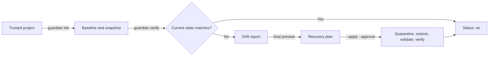

# Guardian Guide

Guardian is Sona's project-local resilience and drift-detection system. It
captures a trusted baseline, compares the current project with that baseline,
preserves suspect files, and can restore a reviewed snapshot through an
explicitly approved recovery flow.

Guardian is not antivirus software, a host-intrusion detector, or a remote
backup service. It does not silently apply AI-generated repairs.

## Mental model

Guardian separates four responsibilities:

1. **Baseline:** record the trusted configuration and exact hashes of tracked
   project files.
2. **Detection:** report added, changed, missing, or configuration-drifted
   files without modifying the project.
3. **Preservation:** copy suspect state into project-local quarantine before a
   recovery changes files.
4. **Recovery:** restore an integrity-checked snapshot, run trusted validation,
   verify the restored state, and record the result.



## Create a safe practice project

Use a dedicated child directory. Do not initialize Guardian directly on
`$env:TEMP`, a drive root, or an unrelated source repository. Those locations
can contain inaccessible or unrelated files and produce permission errors or an
unintentionally broad baseline.

```powershell
$project = Join-Path $env:TEMP ("sona-guardian-guide-{0}" -f [guid]::NewGuid())
New-Item -ItemType Directory -Path $project | Out-Null
Set-Location $project

'print("Guardian baseline")' |
  Set-Content -LiteralPath .\app.sona -Encoding ascii

sona guardian init --project-root .
sona guardian status --project-root .
sona guardian verify --project-root .
```

Expected status shapes are:

- `initialized` from `guardian init`;
- `initialized: true` from `guardian status`; and
- `status: "ok"` with empty `added`, `changed`, and `missing` arrays from
  `guardian verify`.

## What initialization records

`sona guardian init` creates project-local state beneath `.sona/guardian` and
captures a baseline snapshot. The important layout is:

```text
.sona/
└── guardian/
    ├── baseline.json
    ├── trusted_config.json
    ├── circuit_breaker.json        # created when a recovery safety check fails
    ├── snapshots/
    ├── quarantine/
    ├── audit/
    │   └── audit.jsonl
    └── receipts/                    # governed mutation receipts when applicable
```

The exact internal layout is implementation-owned. Scripts should use Guardian
commands and returned schema fields rather than editing these files.

Initialization records:

- a SHA-256 inventory of tracked project files;
- a baseline snapshot ID;
- a trusted copy and hash of `sona.guard.json`, when present;
- configured exclusions; and
- configured validation commands.

## Optional configuration

Place `sona.guard.json` in the project root before initialization:

```json
{
  "validation_commands": [
    ["python", "-m", "pytest", "-q"]
  ],
  "auto_recover": false,
  "excludes": [
    "coverage/**",
    ".cache/**"
  ]
}
```

| Field | Purpose |
| --- | --- |
| `validation_commands` | Argument arrays or command strings trusted at initialization for approved recovery verification |
| `auto_recover` | Trusted policy metadata; read-only verification still never applies recovery by itself in 0.15.4 |
| `excludes` | Additional project-relative glob patterns omitted from inventory and snapshots |

Argument arrays are preferred because they preserve command boundaries without
shell interpolation.

Configuration is security-sensitive. Guardian stores the trusted configuration
hash at initialization. Later edits to `sona.guard.json` are reported as
configuration drift and are not silently adopted.

In 0.15.4, `guardian verify --run-validation` remains read-only. It reports each
trusted command as `not-executed`; trusted validation commands run during the
post-restore phase of an approved recovery.

## Default exclusions

Guardian excludes common generated and sensitive paths by default:

```text
.git/**
.venv/**
__pycache__/**
dist/**
build/**
*.pyc
.env
.env.*
*.pem
*.key
*.p12
*.pfx
.sona/guardian/**
.sona/receipts/**
.sona/governance/**
```

Guardian does not recursively snapshot its own state. Exclusions reduce
accidental secret capture, but they are not a substitute for reviewing project
contents before initialization.

## Detect drift

Change and add files in the practice project:

```powershell
'print("Changed after baseline")' |
  Set-Content -LiteralPath .\app.sona -Encoding ascii
'new file' | Set-Content -LiteralPath .\new.txt -Encoding ascii

sona guardian verify --project-root .
sona guardian diff --project-root .
sona guardian report --project-root .
```

`verify` is strictly read-only. It reports:

| Field | Meaning |
| --- | --- |
| `added` | Tracked files present now but absent from the baseline |
| `changed` | Tracked files whose current SHA-256 differs from the baseline |
| `missing` | Baseline files no longer present |
| `config_drift` | Whether the current `sona.guard.json` differs from trusted configuration |
| `drift_classification` | Whether matching governed change receipts explain the drift or it remains suspicious |

`diff` returns the compact drift subset. `report` prints a short human-readable
summary; `report --json` returns the full status, verification, doctor, and
recent Proof-attestation information.

## Read-only and state-changing commands

| Command | Effect |
| --- | --- |
| `sona guardian status` | Read Guardian initialization and circuit-breaker state |
| `sona guardian verify` | Compare current state with the trusted baseline; project and Guardian state remain unchanged |
| `sona guardian diff` | Return the compact verification difference |
| `sona guardian doctor` | Report readiness, trusted configuration, and exclusions |
| `sona guardian report` | Produce a plain or JSON report |
| `sona guardian history` / `audit` | Read recent Guardian audit records |
| `sona guardian init` | Write trusted configuration, baseline, snapshot, and audit state |
| `sona guardian snapshot` | Copy tracked files into a new Guardian snapshot and record an audit event |
| `sona guardian quarantine` | Copy selected suspect files into quarantine and record an audit event |
| `sona guardian graph` | Build the project relationship graph and record an audit event |
| `sona guardian heal --apply --approve` | Run the governed recovery workflow |
| `sona guardian rollback --apply --approve` | Restore a selected or latest snapshot through the governed recovery workflow |

Quarantine preserves copies; it does not by itself delete or neutralize the
original project files.

## Preserve suspect files manually

With no paths, Guardian selects added and changed files from the current drift
report:

```powershell
sona guardian quarantine --project-root . --reason investigation
```

Or specify project-relative paths:

```powershell
sona guardian quarantine --project-root . `
  --reason investigation `
  .\app.sona .\new.txt
```

Guardian rejects traversal and symlink escapes outside the explicit project
root.

## Preview and apply recovery

Always inspect the drift and recovery plan first:

```powershell
sona guardian verify --project-root .
sona guardian heal --project-root .
```

The non-applying command returns `status: "recommend-apply"` and a plan.

The built-in governance policy is audit-only. It intentionally denies Guardian
workspace mutation even when `--approve` is present. The usual denied result
explains that mutation requires `mode=enforce`, non-denied capabilities, and
scoped approval.

For a project that should support controlled recovery, save a reviewed policy
as `.sona/governance.json` **before** `guardian init`, then include that policy
in the trusted baseline. A conservative 0.15.4 policy is:

```json
{
  "schema_version": 1,
  "mode": "enforce",
  "providers": {
    "deterministic": "allow",
    "local": "allow",
    "ollama": "allow",
    "huggingface": "ask",
    "azure": "ask",
    "openai_compatible": "ask",
    "claude": "deny",
    "codex": "deny"
  },
  "capabilities": {
    "read_workspace": "allow",
    "write_workspace": "ask",
    "apply_patch": "ask",
    "execute_code": "ask",
    "network_access": "ask",
    "read_secrets": "deny",
    "install_packages": "deny",
    "run_shell": "deny"
  },
  "limits": {
    "maximum_files_per_task": 10,
    "maximum_patch_bytes": 100000,
    "maximum_context_tokens": 32000,
    "maximum_estimated_cost_usd": 0.25,
    "require_known_cost": false
  }
}
```

Validate it before establishing the baseline:

```powershell
sona govern validate --policy .\.sona\governance.json
sona guardian init --project-root .
```

If a project is already initialized, do not add a policy and immediately hide
unexplained drift by reinitializing. Resolve and review current drift first,
then add the policy and deliberately establish a new trusted baseline.

With an enforcing policy that asks for `write_workspace` and `execute_code`,
explicitly approve and apply the reviewed plan:

```powershell
sona guardian heal --project-root . --apply --approve
```

An applied recovery performs these steps:

1. evaluate governance and explicit approval;
2. verify snapshot integrity;
3. copy suspect current files to quarantine;
4. restore baseline snapshot files and remove newly added tracked files;
5. run validation commands trusted at initialization;
6. verify restored file hashes and project state; and
7. append audit and governed mutation receipts.

If snapshot integrity, restored hashes, validation, or final verification
fails, Guardian stops and opens its circuit breaker. A circuit breaker prevents
repeated automatic damage from a failing recovery path; inspect `guardian
doctor`, the audit history, and the reported failure before proceeding.

Governance policy may still deny an applied recovery. The `--approve` flag
satisfies scoped `ask` rules; it does not override `deny`, `mode=audit`,
`mode=off`, or Sona's hard safety boundaries.

## Accept intentional project changes

Do not recover files that you intentionally changed. Review and test those
changes first. When the current project should become the new trusted state,
rerun initialization deliberately:

```powershell
sona guardian verify --project-root .
sona guardian init --project-root .
sona guardian verify --project-root .
```

Reinitialization updates trusted configuration and points the active baseline at
a new baseline snapshot. Treat this as a trust decision, not a routine way to
hide unexplained drift.

## Guardian and Native Proof

Guardian can verify and locally attest Native Proof receipts that were created
with `--guardian-root`. These commands are covered end to end in
[Using Native Proof and Guardian Together](proof-and-guardian.md):

```text
sona guardian proof verify
sona guardian proof attest
sona guardian proof review
sona guardian proof history
```

Guardian verification and attestation never turn local evidence into signer,
machine, hardware, or remote attestation.

## Public Sona module

The `guardian` standard-library facade exposes the same project-local service:

```sona
import guardian;

let state = guardian.status(".");
let verified = guardian.verify(".");
let report = guardian.report_plain(".");
print(report);
```

The facade also exports `proof_verify`, `proof_attest`, `proof_review`, and
`proof_history`. Importing `guardian` alone does not initialize or mutate a
project.

## Troubleshooting

### Project path does not exist

`E:\your-guardian-project` in examples is a placeholder, not a real directory.
Create a dedicated directory first or pass the path to an existing project.

### Permission denied while initializing

Confirm that `--project-root` points to a dedicated project directory and not
directly to `$env:TEMP`, a drive root, or a directory containing files owned by
another process. Check the files Guardian would inventory, close programs
holding locks, and retry in a new dedicated child directory.

### Guardian is unavailable or uninitialized

Run:

```powershell
sona guardian doctor --project-root .
sona guardian init --project-root .
```

### Verification reports drift immediately after initialization

Look for generated files that are not excluded and for a changed
`sona.guard.json`. Add reviewed generated-file patterns to `excludes` before
initialization, then intentionally establish a new baseline.

For the complete field-level behavior, see the
[Guardian reference](../GUARDIAN_REFERENCE.md).
