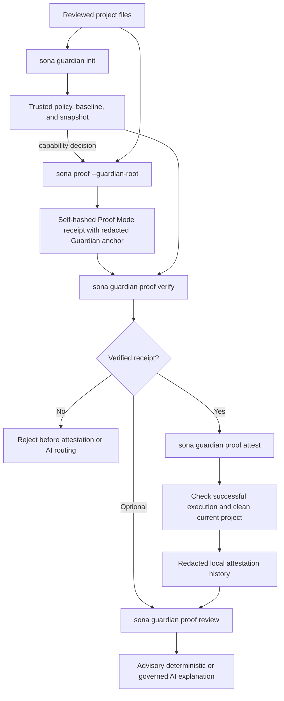

# Using Proof Mode and Guardian Together

Proof Mode and Guardian solve different parts of a local release-trust
workflow:

- **Proof Mode** records redacted evidence for one Native Core
  execution.
- **Guardian** records which capability policy and project state were trusted,
  applies supported decisions to Native Core, and detects later drift.
- **Guardian-bound Proof Mode** ties the execution receipt to that policy and
  trusted baseline.
- **Guardian attestation** records that a successful bound receipt was checked
  while the current project was still clean.
- **AI review** explains verified redacted facts but adds no trust.

In this guide, Guardian "attestation" means a project-local audit record made
after repeat verification and a clean-state check. It is not cryptographic,
remote, hardware, operating-system, or trusted-runtime attestation.

The integration is explicit at every step. Neither subsystem silently enables
or mutates the other.

## Trust-chain overview



## What each step establishes and does not establish

| Step | What it establishes | What it does not establish |
| --- | --- | --- |
| `guardian init` | A local trusted capability policy, file-hash baseline, and snapshot | That the project is globally safe or authored by a known signer |
| Native `proof` | One redacted, self-hashed Native Core execution record | Machine integrity, identity, remote attestation, or Python parity |
| `proof --guardian-root` | The exact input matched the baseline and supported requested capabilities were intersected with trusted Guardian decisions | That the project can never drift after execution or that Native HTTP is implemented |
| `guardian proof verify` | Receipt canonicality, self-hash, Native/no-Python identity, matching Guardian anchor, and baseline-tracked program identity | That the current working tree is clean |
| `guardian proof attest` | A successful verified receipt was checked while `guardian verify` reported a clean current project | A remote signature, hardware root of trust, or third-party timestamp |
| `guardian proof review` | A governed reviewer analyzed the verified redacted packet | Any additional verification, signature, attestation, or trust |

The distinction between verification and attestation matters. Receipt
verification checks the receipt against the trusted baseline. Attestation also
checks the live project for drift and accepts only a successful execution.

## Prerequisites

You need both command surfaces:

```powershell
sona --version
sona-native --version
```

Expected shapes:

```text
Sona 0.15.6
Sona native 0.15.6
```

The user-facing `sona proof` command delegates generation to `sona-native` on
`PATH`. For an archive-local Native Core executable, set `SONA_NATIVE_BINARY`
to `.\sona.exe`. Direct `sona-native proof ...` remains equivalent.

## Complete PowerShell workflow

The following walkthrough creates a dedicated temporary project, so it does
not depend on a placeholder path or modify an existing repository.

### 1. Create the project and receipt directory

```powershell
$project = Join-Path $env:TEMP `
  ("sona-guardian-proof-guide-{0}" -f [guid]::NewGuid())
New-Item -ItemType Directory -Path $project | Out-Null
Set-Location $project

'print("Guardian-bound Proof Mode: OK")' |
  Set-Content -LiteralPath .\hello.sona -Encoding ascii
New-Item -ItemType Directory -Path .\.sona\receipts | Out-Null
```

Create every source file that must be trusted before establishing the baseline.
The `.sona/receipts` directory is excluded from Guardian inventory, but Proof
Mode requires it to exist before publishing a receipt.

### 2. Establish and verify the Guardian baseline

```powershell
sona guardian init --project-root .
sona guardian check --project-root .
sona guardian explain --project-root .
```

Do not continue unless initialization reports `initialized` (or the safe
`already-initialized` no-op), check reports `status: "ok"`, and Proof Mode is
reported as ready.

### 3. Create a unique receipt path

Proof Mode never overwrites a receipt, so generate a new filename for every
run:

```powershell
$receipt = Join-Path (Resolve-Path .\.sona\receipts) `
  ("hello-proof-{0}.json" -f [guid]::NewGuid())
```

### 4. Run Guardian-bound Proof Mode

```powershell
sona proof .\hello.sona `
  --receipt $receipt `
  --engine native `
  --guardian-root . `
  --summary
```

`--summary` intentionally writes its human-readable confirmation to stderr. A
strict PowerShell automation harness that promotes native stderr records to
errors can omit `--summary`; receipt contents and the evidence claim are
unchanged.

Before executing the program, Native Core:

1. canonicalizes the explicit Guardian project root;
2. safely reads `.sona/guardian/baseline.json` and `trusted_config.json`;
3. confirms the program is inside that project;
4. confirms its exact source hash is tracked by the active baseline; and
5. validates the canonical trusted capability policy;
6. intersects capability requests with Guardian's trusted decisions; and
7. builds a redacted Guardian anchor.

If any binding check fails, Native Core emits `PROOF-008`, does not execute the
program, and does not publish a receipt.

The receipt's `guardian` member contains only:

```json
{
  "schema_id": "sona.guardian-proof-binding.schema-1",
  "baseline_snapshot_id": "...",
  "baseline_sha256": "sha256:...",
  "trusted_config_sha256": "sha256:...",
  "policy_sha256": "sha256:...",
  "policy_enforced": true,
  "program_baseline": "tracked"
}
```

It does not contain the project root, program path, baseline inventory, source,
or Guardian configuration contents. Native Core reads Guardian state directly;
it does not import Python, execute Guardian, mutate Guardian state, or append a
Guardian audit record while creating the receipt.

### 5. Verify the receipt

```powershell
sona guardian proof verify `
  --project-root . `
  --receipt $receipt
```

Expected result:

```json
{
  "status": "verified",
  "message": "Proof Mode receipt matches this Guardian baseline and declared policy binding."
}
```

The actual result includes the receipt hash, execution status, Guardian anchor,
and accessibility metadata. Verification is read-only and does not copy the
receipt into Guardian state.

### 6. Record a local attestation

```powershell
sona guardian proof attest `
  --project-root . `
  --receipt $receipt
```

Attestation repeats receipt verification, requires
`execution.status: "ok"`, and runs live Guardian verification. It rejects the
attestation if the current project has drifted.

A successful attestation appends `guardian.proof.attest` to Guardian's local
audit history. The record contains the receipt hash, execution status, and
redacted Guardian anchor. It does not copy source, paths, output bodies, or the
receipt itself.

### 7. Run governed advisory review

Use the deterministic local reviewer for a reproducible release check:

```powershell
sona guardian proof review `
  --project-root . `
  --receipt $receipt `
  --provider deterministic
```

Expected status is `reviewed`. The result identifies the reviewer as advisory
and states that the analysis is outside the Proof and Guardian trust chain.

With configured local Ollama:

```powershell
sona guardian proof review `
  --project-root . `
  --receipt $receipt `
  --provider ollama
```

Remote providers require explicit provider selection, `--allow-network`, and a
governance policy that permits the route. Policy can still deny or require
approval. A provider failure returns `review-unavailable`; it does not revoke
the underlying verified receipt.

### 8. Inspect local attestation history

```powershell
sona guardian proof history --project-root . --limit 10
```

History contains local `guardian.proof.attest` audit entries. AI review is not
an attestation and does not appear as one.

## AI review boundary

`guardian proof review` performs receipt verification before provider routing.
Rejected, noncanonical, wrongly bound, or unsupported receipts never reach a
provider.

The exact canonical review packet contains verified, redacted facts only. Its
shape is:

```json
{
  "schema_id": "sona.guardian-proof-ai-review.schema-1",
  "proof_status": "verified",
  "receipt_hash": "sha256:...",
  "execution": {
    "status": "ok",
    "exit_code": 0
  },
  "runtime_evidence": {
    "sona_version": "0.15.6",
    "program": {
      "kind": "source",
      "source": {"sha256": "sha256:...", "bytes": 123}
    },
    "engine": {
      "name": "native",
      "python_required": false,
      "python_embedded": false,
      "fallback_used": false
    },
    "capabilities": {
      "console": true,
      "filesystem_read": true,
      "filesystem_write": false,
      "network": false,
      "process": false,
      "environment": false
    },
    "execution": {
      "status": "ok",
      "exit_code": 0,
      "stdout": {"sha256": "sha256:...", "bytes": 8},
      "stderr": {"sha256": "sha256:...", "bytes": 0}
    },
    "effects": [
      {
        "sequence": 1,
        "effect": "FS.READ",
        "support": "SUPPORTED",
        "scope": "filesystem",
        "operation": "fs.read_text",
        "outcome": "allowed"
      }
    ]
  },
  "guardian": {
    "schema_id": "sona.guardian-proof-binding.schema-1",
    "baseline_snapshot_id": "...",
    "baseline_sha256": "sha256:...",
    "trusted_config_sha256": "sha256:...",
    "program_baseline": "tracked"
  },
  "local_attestation_recorded": true,
  "observation_boundary": {
    "effect_source": "instrumented-native-host-boundaries",
    "agent_action": "not-represented",
    "ai_request_causality": "not-established"
  }
}
```

Sona returns `review_input_hash`, the SHA-256 identity of this exact packet. It
does not provide project paths, receipt paths, source, selected workspace
files, stdout/stderr bodies, environment values, or credentials as review
context. Effect target fingerprints are also removed before provider routing.

The packet lets a reviewer explain real capabilities and observed effects. It
does not establish `AGENT.ACTION`, AI authorship, or a causal link from an AI
request to the execution. Developer-intelligence task records are separate
application metadata and are not Proof Mode receipts.

Proof review writes no AI task receipt and does not mutate `.sona/guardian`.
Provider-routing decisions may be written to the separate
`.sona/governance/audit.jsonl` governance audit.

See [Proof Mode and Trusted Automation](../spec/proof/automation.md) for the
normative AI/evidence boundary.

## Order-sensitive behavior

### The program changes after Guardian initialization

Proof Mode with `--guardian-root` fails with `PROOF-008` before execution
because the exact source no longer matches the baseline. Review the change and
intentionally establish a new baseline before proving it.

### The project drifts after receipt creation

`guardian proof verify` can still report `verified` because the stored
canonical receipt remains correctly bound to the selected local baseline. A new
`guardian proof attest` rejects with `guardian-drift` until the live project is
clean or intentionally re-baselined.

### The program execution fails

Proof Mode can publish a valid failed-execution receipt. Guardian can verify its
integrity, but `guardian proof attest` rejects it with
`execution-not-successful`.

### The receipt is edited or reformatted

Guardian rejects it. Verification requires canonical receipt storage and a
matching `receipt_hash`; even semantically equivalent reformatting is not the
published canonical byte form.

### The receipt was created without `--guardian-root`

It remains a standalone Proof Mode receipt, but Guardian rejects it as
`unbound-receipt`. Generate a new receipt explicitly bound to the initialized
project.

## Common rejection reasons

| Reason | Meaning |
| --- | --- |
| `guardian-unavailable` | Guardian has no consistent trusted baseline for this root |
| `invalid-receipt` | The receipt is missing, unsafe, unreadable, or structurally inconsistent |
| `receipt-not-canonical` | Stored bytes differ from the canonical receipt form |
| `receipt-hash-mismatch` | Canonical receipt contents do not match `receipt_hash` |
| `unsupported-receipt` | The file is not a schema-1 Native Core/no-Python Proof receipt |
| `unbound-receipt` | The proof was not created with `--guardian-root` |
| `guardian-binding-mismatch` | Receipt anchor does not match this Guardian baseline |
| `guardian-policy-mismatch` | Receipt policy identity does not match the trusted Guardian capability policy |
| `program-not-baseline-tracked` | Program identity is absent from the trusted baseline |
| `execution-not-successful` | A failed execution cannot be attested |
| `guardian-drift` | The current project is not clean enough for a new attestation |
| `review-unavailable` | Proof remains verified, but the governed reviewer did not produce analysis |

## Release checklist

For each release candidate:

1. review project files and `sona.guard.json`;
2. initialize Guardian without replacing existing state;
3. require `sona guardian check` to return `ok` and Proof Mode readiness;
4. generate a unique Guardian-bound Proof Mode receipt;
5. require `sona guardian proof verify` to return `verified`;
6. require `sona guardian proof attest` to return `attested`;
7. optionally run deterministic or governed AI review;
8. preserve the proof receipt, Guardian audit history, release artifacts, and
   published SHA-256 checksums together; and
9. complete the separate clean-host and cross-platform release gates.

The Windows Native Core ZIP belongs on the GitHub Release as a separate asset.
The Python wheel and source archive belong on PyPI, and the VSIX belongs on the
VS Code Marketplace and/or GitHub Release. Do not embed the Native Core ZIP in
the Python wheel or VSIX.

## Limits of the combined claim

The combined workflow creates a self-consistent local chain between reviewed
project state and one Native Core execution. It provides deterministic
integrity checking, not authentication. It does not provide signer identity,
trusted timestamping, cryptographic or remote attestation, hardware-backed
integrity, malware detection, a protected trust anchor, or protection against
an actor able to replace and re-hash both the receipt and local Guardian state.

Continue with the standalone [Proof Mode guide](proof-mode.md), the
standalone [Guardian guide](guardian.md), or the field-level
[Proof Mode reference](../reference/native-proof-mode.md).
