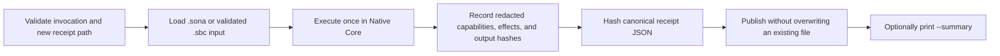

# Native Proof Mode Guide

Native Proof Mode runs one `.sona` program or source-backed `.sbc` container in
Native Core and publishes a redacted, self-hashed JSON receipt for that
execution. Use it when you need durable evidence of what engine ran, what
capabilities were granted, whether execution succeeded, and which observable
effects occurred.

Proof Mode is an evidence layer around Native Core. It does not change program
semantics, prove Python/Native parity, identify a signer, or attest the machine
or operating system.

## Choose the correct executable

Sona 0.15.4 has separate Python-compatible and Native Core command surfaces:

| Command | Purpose |
| --- | --- |
| `sona` | Python-compatible CLI, Guardian, package tools, and developer intelligence |
| `sona-native` | Convenient installed name for the standalone Native Core executable |
| `sona.exe` | Filename inside the Windows Native Core release ZIP |

This guide uses `sona-native`. If you extracted the Native Core ZIP without
renaming its executable, substitute `.\sona.exe`. On another platform or a
local Native Core build, substitute the path to that `sona` binary.

The Python CLI does not implement `sona proof`. A command such as
`sona proof app.sona ...` works only when `sona` is the Native Core executable.

Check the installed native command:

```powershell
sona-native --version
```

Expected shape:

```text
Sona native 0.15.4
```

## First proof receipt

Use a dedicated project directory rather than initializing or testing directly
in the system temporary-directory root:

```powershell
$project = Join-Path $env:TEMP ("sona-proof-guide-{0}" -f [guid]::NewGuid())
New-Item -ItemType Directory -Path $project | Out-Null
Set-Location $project

'print("Proof Mode is working")' |
  Set-Content -LiteralPath .\hello.sona -Encoding ascii
New-Item -ItemType Directory -Path .\.sona\receipts | Out-Null

$receipt = Join-Path (Resolve-Path .\.sona\receipts) `
  ("hello-proof-{0}.json" -f [guid]::NewGuid())

sona-native proof .\hello.sona `
  --receipt $receipt `
  --engine native `
  --summary
```

The program prints its normal output. After a successful receipt publication,
`--summary` adds a human-readable confirmation similar to:

```text
Proof receipt saved
  Execution     succeeded
  Engine        Native Core
  Receipt       ...\hello-proof-....json
  Evidence      1 observed effect
  Output        22 B stdout, 0 B stderr
  Duration      0 ms
  Receipt hash  sha256:...
```

The summary is written to stderr so program stdout remains suitable for normal
pipelines. Omit `--summary` when a script needs the exact `sona run`-compatible
stdout/stderr contract.

Strict Windows PowerShell automation can promote native stderr records to
errors when `$ErrorActionPreference` is `Stop`, especially when streams are
merged. In that kind of harness, omit `--summary` or capture stderr separately
and evaluate the native exit code and receipt publication explicitly.

## What happens internally



The receipt parent directory must already exist. The final receipt path must be
new. Proof Mode creates a same-directory temporary file, flushes the receipt,
and publishes without replacing an existing destination. A receipt publication
failure never becomes a successful proof claim.

## Command anatomy

```text
sona-native proof <program.sona|program.sbc>
  --receipt <new-receipt.json>
  [--engine native]
  [--summary]
  [--guardian-root <initialized-project>]
  [--allow-fs-read]
  [--allow-fs-write]
  [--allow-network]
```

Only one program and one receipt destination are accepted. `--engine native`
is optional but useful in release scripts because it makes the intended engine
explicit. `--guardian-root` is covered in the
[combined Proof and Guardian guide](proof-and-guardian.md).

## Receipt contents

Receipts use `sona.native-proof.schema-1` and contain these sections:

| Section | Meaning |
| --- | --- |
| `program` | Input kind, byte count, and SHA-256 identity; source text and paths are omitted |
| `engine` | Native engine identity plus explicit no-Python and no-fallback flags |
| `capabilities` | Capabilities granted for this execution |
| `execution` | Status, exit code, duration, stable diagnostic metadata, and stdout/stderr byte counts and hashes |
| `effects` | Ordered, redacted observations such as console output or filesystem attempts |
| `guardian` | Present only for an explicitly Guardian-bound proof |
| `receipt_hash` | SHA-256 of the canonical receipt with this member omitted |

Inspect a receipt in PowerShell:

```powershell
$proof = Get-Content -Raw -LiteralPath $receipt | ConvertFrom-Json
$proof.schema_id
$proof.engine
$proof.capabilities
$proof.execution
$proof.effects
$proof.receipt_hash
```

Proof receipts never include source text, raw program or project paths,
stdout/stderr bodies, stdin values, environment values, credentials, network
request bodies, temporary paths, or raw operating-system error text.

Filesystem effect targets use an execution-local `hmac-sha256:` fingerprint.
The random key is not stored, so the same path cannot usefully be correlated
between separate receipts.

## Capabilities and observed effects

Native Core grants console access by default. Filesystem access is denied until
the corresponding flag is supplied:

```powershell
sona-native proof .\reader.sona `
  --receipt .\.sona\receipts\reader-proof.json `
  --allow-fs-read
```

`--allow-fs-write` grants native filesystem writes. Grant only the capability
the program actually needs. The receipt records both allowed and denied
observed effects.

`--allow-network` records that network policy was granted, but Native Core HTTP
remains unavailable in 0.15.4. Process and environment capabilities remain
disabled.

The receipt-writing operation is owned by the Proof runner. Publishing the
requested receipt does not grant the Sona program filesystem-write access.

## Successful and failed executions

A successfully executed program produces `execution.status: "ok"` and exit
code `0`.

A program diagnostic can still produce a valid receipt. In that case, the
receipt records `execution.status: "failed"`, exit code `1`, and stable
diagnostic metadata. The original program diagnostic remains the terminal
diagnostic; Proof Mode does not relabel parser, VM, runtime, or capability
errors as infrastructure failures.

A failed execution receipt is evidence that the failed execution occurred. It
is not evidence of a successful run and cannot be locally attested by Guardian.

## Input types

Proof Mode accepts:

- `.sona` UTF-8 source files; and
- version-1 source-backed `.sbc` containers that pass normal Native Core
  container validation.

An `.sbc` receipt identifies both the container bytes and its validated embedded
source. Malformed containers retain their normal `SONA-NATIVE-BYTECODE-*`
diagnostics and do not publish a Proof receipt.

## Proof diagnostics

| Diagnostic | Meaning | Typical correction |
| --- | --- | --- |
| `PROOF-001` | Invalid command shape or option | Supply one program, exactly one `--receipt`, and only documented options |
| `PROOF-002` | Unsupported input type | Use `.sona` or a validated source-backed `.sbc` |
| `PROOF-003` | Invalid receipt destination | Create the parent directory and provide a regular file path |
| `PROOF-004` | Receipt path already exists | Generate a new filename; Proof Mode never overwrites |
| `PROOF-005` | Temporary receipt creation failed | Check directory permissions and retry with a new path |
| `PROOF-006` | Receipt serialization failed | Retry; no receipt was published |
| `PROOF-007` | Receipt finalization or durability failed | Do not claim publication; inspect the destination before retrying |
| `PROOF-008` | Guardian binding unavailable or inconsistent | Initialize Guardian and prove an unchanged baseline-tracked program |

`sona-native proof --help` is not a supported parser form in 0.15.4 because
Proof Mode expects the program path first. Use `sona-native --help` for the
Native Core command summary and this guide for the complete option contract.

## Security claim and limits

Proof Mode gives you redacted, self-hashed,
tamper-evident-after-creation evidence for one Native Core execution. It does
not provide:

- cryptographic signer identity;
- trusted hardware or operating-system integrity;
- remote or machine attestation;
- protection from an actor who can replace both evidence and trusted local
  state; or
- proof that Python-compatible and Native Core executions are semantically
  identical.

For a receipt tied to known local project state, continue with
[Using Native Proof and Guardian Together](proof-and-guardian.md). For the
field-level contract, see the
[Native Proof Mode reference](../reference/native-proof-mode.md).
