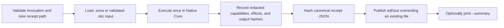

# Proof Mode Guide

New to Sona's trust workflow? Complete
[Get Started with Proof Mode](../getting-started/README.md) first.

Proof Mode runs one `.sona` program or source-backed `.sbc` container in
Native Core and publishes a redacted, self-hashed JSON receipt for that
execution. Use it when you need durable evidence of what engine ran, what
capabilities were granted, whether execution succeeded, and which observable
effects occurred.

Proof Mode is an evidence layer around Native Core. It does not change program
semantics, prove Python/Native parity, identify a signer, or attest the machine
or operating system.

## Install both command surfaces

Sona 0.15.5 has separate Python-compatible and Native Core command surfaces:

| Command | Purpose |
| --- | --- |
| `sona` | User-facing coordinator, receipt verification, Guardian, package tools, and developer intelligence |
| `sona-native` | Convenient installed name for the standalone Native Core executable |
| `sona.exe` | Filename inside the Windows Native Core release ZIP |

The installed `sona` command coordinates the complete workflow. For generation,
it delegates directly to `sona-native`; Native Core remains the only receipt
producer and no Python-compatible execution or fallback is allowed. Receipt
verification and inspection remain in the Python command.

Generation discovers `sona-native` on `PATH`. If you extracted an archive and
did not install that command, set `SONA_NATIVE_BINARY` to the standalone
`sona` or `sona.exe` path. An explicitly configured path must be a regular file
and takes priority over `PATH`. Sona never resolves a generic `sona` from
`PATH`, which prevents delegation from returning to the Python launcher.

Check the installed native command:

```powershell
sona-native --version
sona proof --help
```

Expected shape:

```text
Sona native 0.15.5
```

## First proof receipt

Use a dedicated project directory rather than initializing or testing directly
in the system temporary-directory root:

```powershell
$project = Join-Path $env:TEMP ("sona-proof-guide-{0}" -f [guid]::NewGuid())
New-Item -ItemType Directory -Path $project | Out-Null
Set-Location $project

'print("Proof Mode is working")' |
  Set-Content -LiteralPath .\hello.sona -Encoding ascii
New-Item -ItemType Directory -Path .\.sona\receipts | Out-Null

$receipt = Join-Path (Resolve-Path .\.sona\receipts) `
  ("hello-proof-{0}.json" -f [guid]::NewGuid())

sona proof .\hello.sona `
  --receipt $receipt `
  --engine native `
  --summary
```

The program prints its normal output. After a successful receipt publication,
`--summary` adds a human-readable confirmation similar to:

```text
Proof receipt saved
  Execution     succeeded
  Engine        Native Core
  Receipt       ...\hello-proof-....json
  Evidence      1 observed effect
  Output        22 B stdout, 0 B stderr
  Duration      0 ms
  Receipt hash  sha256:...
```

The summary is written to stderr so program stdout remains suitable for normal
pipelines. Omit `--summary` when a script needs the exact `sona run`-compatible
stdout/stderr contract.

Strict Windows PowerShell automation can promote native stderr records to
errors when `$ErrorActionPreference` is `Stop`, especially when streams are
merged. In that kind of harness, omit `--summary` or capture stderr separately
and evaluate the native exit code and receipt publication explicitly.

## What happens internally



The receipt parent directory must already exist. The final receipt path must be
new. Proof Mode creates a same-directory temporary file, flushes the receipt,
and publishes without replacing an existing destination. A receipt publication
failure never becomes a successful proof claim.

## Command anatomy

```text
sona proof <program.sona|program.sbc>
  --receipt <new-receipt.json>
  [--engine native]
  [--summary]
  [--guardian-root <initialized-project>]
  [--allow-fs-read]
  [--allow-fs-write]
  [--allow-network]
```

Only one program and one receipt destination are accepted. `--engine native`
is optional but useful in release scripts because it makes the intended engine
explicit. `--guardian-root` is covered in the
[combined Proof and Guardian guide](proof-and-guardian.md).

Direct `sona-native proof ...` remains supported for native-only environments
and low-level runtime testing. Both forms invoke the same Rust producer and
produce the same schema-1 receipt.

## Receipt contents

Receipts use `sona.native-proof.schema-1` and contain these sections:

| Section | Meaning |
| --- | --- |
| `program` | Input kind, byte count, and SHA-256 identity; source text and paths are omitted |
| `engine` | Native engine identity, explicit no-Python/no-fallback flags, and optional validated executable/source-revision identity |
| `capabilities` | Capabilities granted for this execution |
| `execution` | Status, exit code, duration, stable diagnostic metadata, and stdout/stderr byte counts and hashes |
| `effects` | Ordered, redacted host-boundary observations with low-level operation, normalized identifier, outcome, and support status |
| `guardian` | Present only for an explicitly Guardian-bound proof |
| `receipt_hash` | SHA-256 of the canonical receipt with this member omitted |

Inspect a receipt in PowerShell:

```powershell
$proof = Get-Content -Raw -LiteralPath $receipt | ConvertFrom-Json
$proof.schema_id
$proof.engine
$proof.capabilities
$proof.execution
$proof.effects
$proof.receipt_hash
```

Most users should use the built-in verified views instead of reading JSON:

```powershell
sona proof verify $receipt
sona proof inspect $receipt
```

Both views first state whether the receipt and integrity checks are valid,
whether execution succeeded, what ran, which runtime and engine ran, whether
Python or fallback was involved, the Guardian binding state, capabilities, and
observed effects. Program, Native binary, output, and receipt SHA-256 identities
follow those plain-language facts. A build-supplied source revision is shown
when available. These runtime correlation fields are not authenticated
provenance. Use `--json` on either command for the existing machine-readable
verifier result.

Proof receipts never include source text, raw program or project paths,
stdout/stderr bodies, stdin values, environment values, credentials, network
request bodies, temporary paths, or raw operating-system error text.

Filesystem effect targets use an execution-local `hmac-sha256:` fingerprint.
The random key is not stored, so the same path cannot usefully be correlated
between separate receipts.

## Capabilities and observed effects

Native Core grants console access by default. Filesystem access is denied until
the corresponding flag is supplied:

```powershell
sona proof .\reader.sona `
  --receipt .\.sona\receipts\reader-proof.json `
  --allow-fs-read
```

`--allow-fs-write` grants native filesystem writes. Grant only the capability
the program actually needs. The receipt records both allowed and denied
observed effects.

Current receipts retain the exact low-level observation and add normalized
automation fields. For example, `filesystem` / `fs.read_text` is exposed as
`FS.READ` with `SUPPORTED` observation coverage. Console writes are `PARTIAL`
because the aggregate stream hashes can cover bytes beyond the semantic write
records. Outcome (`allowed`, `denied`, `failed`, or `unavailable`) says what
happened to one attempt; support says how completely that boundary is modeled.

An absent effect is not proof that the operating system or uninstrumented code
performed no such activity. See the [effect vocabulary](../spec/proof/effects.md)
for the complete mapping and limits.

`--allow-network` records that network policy was granted, but Native Core HTTP
remains unavailable in 0.15.5. Process and environment capabilities remain
disabled.

The receipt-writing operation is owned by the Proof runner. Publishing the
requested receipt does not grant the Sona program filesystem-write access.

## Successful and failed executions

A successfully executed program produces `execution.status: "ok"` and exit
code `0`.

A program diagnostic can still produce a valid receipt. In that case, the
receipt records `execution.status: "failed"`, exit code `1`, and stable
diagnostic metadata. The original program diagnostic remains the terminal
diagnostic; Proof Mode does not relabel parser, VM, runtime, or capability
errors as infrastructure failures.

A failed execution receipt is evidence that the failed execution occurred. It
is not evidence of a successful run and cannot be locally attested by Guardian.

## Input types

Proof Mode accepts:

- `.sona` UTF-8 source files; and
- version-1 source-backed `.sbc` containers that pass normal Native Core
  container validation.

An `.sbc` receipt identifies both the container bytes and its validated embedded
source. Malformed containers retain their normal `SONA-NATIVE-BYTECODE-*`
diagnostics and do not publish a Proof receipt.

## Proof diagnostics

| Diagnostic | Meaning | Typical correction |
| --- | --- | --- |
| `PROOF-001` | Invalid command shape or option | Supply one program, exactly one `--receipt`, and only documented options |
| `PROOF-002` | Unsupported input type | Use `.sona` or a validated source-backed `.sbc` |
| `PROOF-003` | Invalid receipt destination | Create the parent directory and provide a regular file path |
| `PROOF-004` | Receipt path already exists | Generate a new filename; Proof Mode never overwrites |
| `PROOF-005` | Temporary receipt creation failed | Check directory permissions and retry with a new path |
| `PROOF-006` | Receipt serialization failed | Retry; no receipt was published |
| `PROOF-007` | Receipt finalization or durability failed | Do not claim publication; inspect the destination before retrying |
| `PROOF-008` | Guardian binding unavailable or inconsistent | Initialize Guardian and prove an unchanged baseline-tracked program |

`sona proof --help` describes the coordinated generation, verification, and
inspection workflow. The low-level Native parser still expects the program
path first; use `sona-native --help` for its command summary.

If `sona proof <program> ...` cannot find or start Native Core, it fails before
execution with `SonaProofLaunchError`, prints an installation or
`SONA_NATIVE_BINARY` hint, and does not create a receipt. Raw operating-system
launch errors are not exposed.

## VS Code Proof Mode Explorer

The Sona `0.15.5` development extension adds a Proof Mode tree to the Sona
activity bar. Its actions are thin clients over the installed CLI:

```text
Run with Proof Mode
Verify Receipt
Inspect Receipt
Open Receipt
Explain with Guardian
```

After a valid receipt is inspected, the tree shows execution result, Native
Core identity, whether Python or fallback was involved, capabilities, grouped
observed effects, Guardian binding, and redacted evidence identities.

The extension does not implement receipt verification or receipt hashing in
TypeScript. It calls `sona proof verify --json` or `sona proof inspect --json`
and displays the shared verifier's normalized result. Program execution and
Guardian review require a trusted VS Code workspace. A requested receipt path
is never overwritten silently.

## Security claim and limits

Proof Mode gives you redacted, self-hashed, integrity-checkable evidence for
one Native Core execution. An actor who replaces the receipt can recompute its
self-hash, so schema-1 does not authenticate the evidence. It does not provide:

- cryptographic signer identity;
- trusted hardware or operating-system integrity;
- remote or machine attestation;
- a protected trust anchor;
- protection from an actor who can replace both evidence and trusted local
  state; or
- proof that Python-compatible and Native Core executions are semantically
  identical.

For a receipt tied to known local project state, continue with
[Using Proof Mode and Guardian Together](proof-and-guardian.md). For the
field-level contract, see the
[Proof Mode reference](../reference/native-proof-mode.md).
